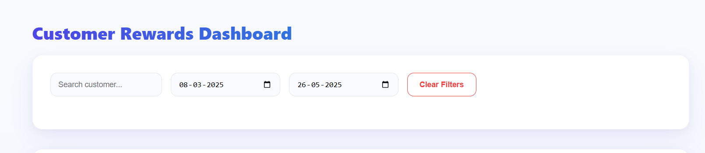
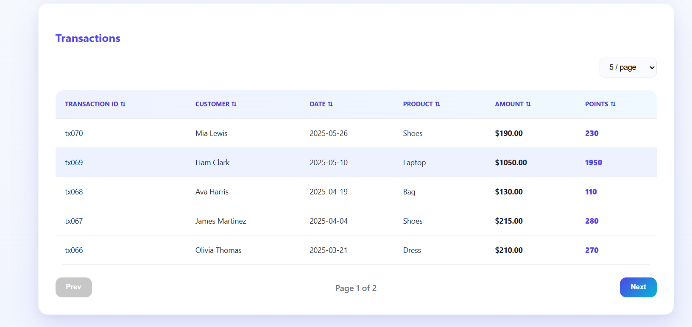
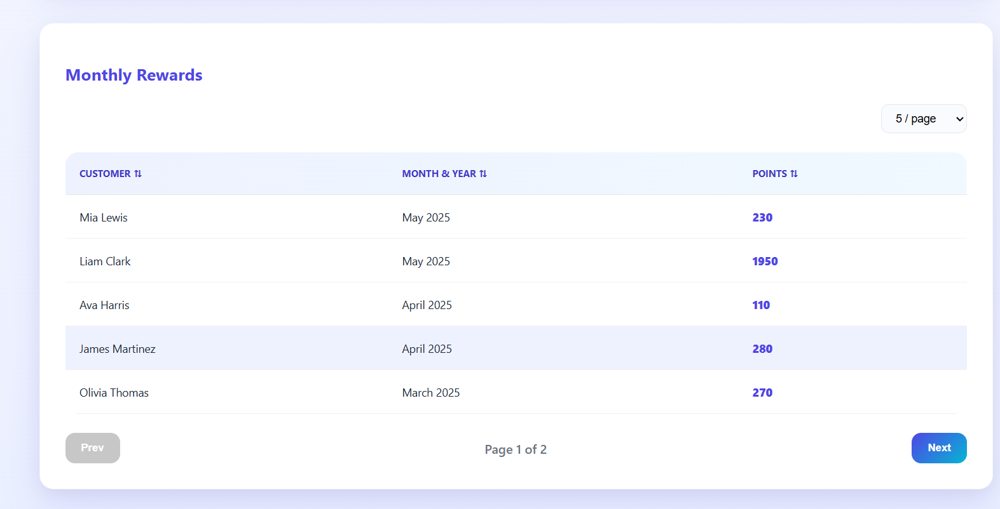
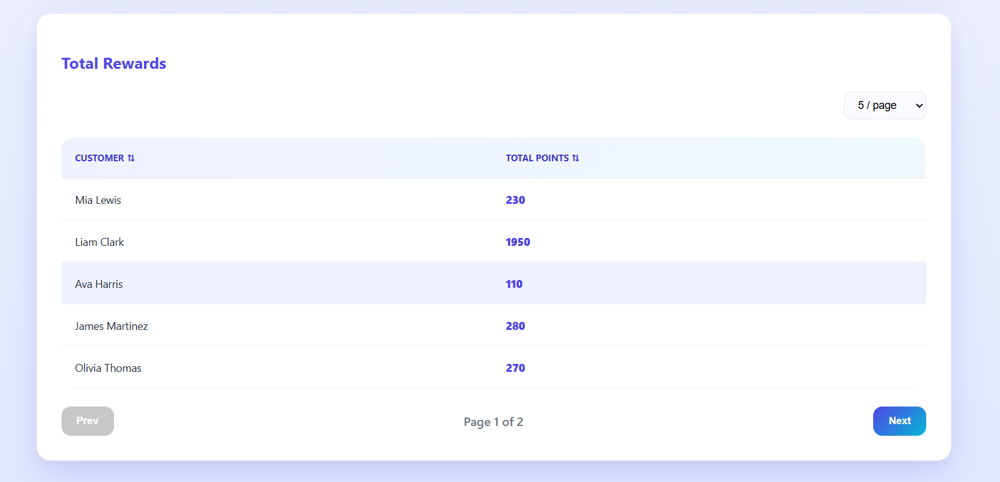

# Rewards Program Dashboard

A **production-ready React application** that simulates a retail customer rewards program with enterprise-grade architecture and user experience.

The application calculates reward points for customer transactions, aggregates them monthly, and provides comprehensive data visualization through an interactive dashboard.

---

## 🚀 Features

### ✅ Core Business Logic

- Reward points calculation per transaction (**stored in reminder, not dollars**)
- Monthly reward aggregation per customer
- Total reward summary per customer
- Supports multi-year transaction history
- Automatically displays latest three months with visible date range

---

### ✅ Production-Grade Architecture

- Real `fetch()` API simulation  
- Async / Await with proper error handling  
- Centralized logger utility  
- Custom React hooks  
- Clean separation of concerns  
- Error Boundary for graceful failure handling  
- Comprehensive JSDoc documentation  
- ESLint configuration enforcing best practices  

---

### ✅ User Experience

- Minimum **3-second loader** for smoother perception  
- Friendly error screen with retry option  
- Empty state handling  
- Modern SaaS-style UI  
- Pre-selected latest 3-month date range  
- One-click **Clear Filters**  

---

### ✅ Data Controls

- Pagination for **ALL tables**
- Dynamic page size (5 / 10 / 20)
- Column sorting across tables
- Search filtering (transactions only)
- Date range filtering
- Reset filters instantly

---

### ✅ Performance Optimizations

- `useMemo` for expensive computations  
- `useCallback` for stable references  
- Immutable data patterns  
- Reusable Table component (DRY principle)  
- Prevented unnecessary re-renders  

---

### ✅ Testing

Unit tests added for:

- reward calculation logic  
- aggregation utilities  
- date helpers  

Includes:

- boundary tests  
- invalid input handling  
- edge cases  

---

## 🧮 Reward Calculation Rules

⚠️ **Important:** All transaction amounts are stored in **cents** to prevent floating-point precision issues.

| Purchase Amount | Reward Points |
|---------------|-------------|
| $0 – $50 | 0 points |
| $51 – $100 | 1 point per dollar over $50 |
| Over $100 | 2 points per dollar over $100 + 50 |

### Examples

| Amount (Cents) | Dollars | Points |
|--------------|---------|--------|
| 7500 | $75.00 | 25 |
| 10000 | $100.00 | 50 |
| 12000 | $120.00 | 90 |
| 15000 | $150.00 | 150 |

---

# 📸 Application Screenshots

---

## 🏠 Initial Dashboard


---

## 🔍 Global Search & Filters



---

## 💳 Transactions Table



---

## 📅 Monthly Rewards



---

## 🏆 Total Rewards



---

# 🧠 Application Flow

```
index.js
  ↓
App.js (with ErrorBoundary)
  ↓
RewardsDashboard
  ↓
useRewardsData (custom hook)
  ↓
transactionsApi (fetch)
  ↓
rewardCalculator (calculate points)
  ↓
getRecentThreeMonthsData (filter)
  ↓
aggregateMonthlyRewards (aggregate by month)
  ↓
aggregateTotalRewards (aggregate total)
  ↓
UI rendering (Tables with sorting & pagination)
```

---

## 📁 Project Structure

```
rewards-program-dashboard/
│
├── public/
│   ├── index.html
│   └── transactions.json         # 70+ mock records (amounts in cents)
│
├── src/
│   ├── api/
│   │   └── transactionsApi.js    # API fetch logic
│   │
│   ├── components/
│   │   ├── ErrorBoundary.js      # Error boundary component
│   │   ├── ErrorMessage.js       # Error display component
│   │   ├── Loader.js             # Loading spinner
│   │   ├── Pagination.js         # Reusable pagination
│   │   ├── Table.js              # Reusable table with sorting
│   │   ├── RewardsDashboard.js   # Main dashboard component
│   │   ├── TransactionsTable.js  # Transactions with filters
│   │   ├── MonthlyRewardsTable.js # Monthly aggregation
│   │   └── TotalRewardsTable.js  # Total aggregation
│   │
│   ├── hooks/
│   │   └── useRewardsData.js     # Custom data management hook
│   │
│   ├── utils/
│   │   ├── rewardCalculator.js   # Points calculation logic
│   │   ├── dateUtils.js          # Date manipulation helpers
│   │   ├── aggregationUtils.js   # Data aggregation functions
│   │   └── logger.js             # Centralized logging
│   │
│   ├── styles/
│   │   └── app.css               # Application styles
│   │
│   ├── __tests__/
│   │   ├── rewardCalculator.test.js
│   │   ├── aggregationUtils.test.js
│   │   └── dateUtils.test.js
│   │
│   ├── App.js                    # Root component
│   └── index.js                  # Entry point
│
├── .eslintrc.json                # ESLint configuration
├── .gitignore                    # Git ignore rules
├── package.json                  # Dependencies & scripts
└── README.md                     # This file
```

---

## 🪵 Logging System

A centralized logger utility is implemented to avoid direct usage of `console.log` across the application.

### Logger Features

- Supports log levels: `info`, `warn`, `error`, `debug`
- Automatically disabled in production
- Structured logging with timestamps
- Easily replaceable with monitoring tools:
  - Sentry
  - Datadog
  - LogRocket

### Example Usage

```javascript
import { logger } from '../utils/logger';

logger.info('Fetching transactions from API');
logger.warn('No transactions found for date range');
logger.error('API request failed', { status: 500 });
logger.debug('Processing transaction', { transactionId: 'tx001' });
```

---

## 🛡️ Error Handling

### Error Boundary

- Catches JavaScript errors anywhere in component tree
- Displays user-friendly error UI
- Logs detailed error information in development
- Provides retry and reload options

### API Error Handling

- Graceful error messages for fetch failures
- Retry functionality
- Loading states for better UX

---

## 🧪 Testing

### Running Tests

```bash
# Run tests in watch mode
npm test

# Run tests with coverage report
npm run test:coverage
```

### Test Coverage

- **rewardCalculator**: Basic rules, edge cases, invalid inputs, boundary values
- **aggregationUtils**: Data filtering, monthly aggregation, total aggregation
- **dateUtils**: Month-year key generation, label formatting

---

## 📦 Installation & Setup

### Prerequisites

- Node.js (v14 or higher)
- npm or yarn

### Installation

```bash
# Clone the repository
git clone <repository-url>

# Navigate to project directory
cd rewards-program-dashboard

# Install dependencies
npm install

# Start development server
npm start
```

The application will open at `http://localhost:3000`

---

## 🔧 Available Scripts

```bash
# Start development server
npm start

# Run tests
npm test

# Run tests with coverage
npm run test:coverage

# Build for production
npm build

# Run ESLint
npm run lint

# Fix ESLint issues
npm run lint:fix
```

---

## 🎨 Code Quality

### ESLint Configuration

- Extends `react-app` and `react-app/jest`
- Enforces consistent code formatting
- Warns about unused variables
- Requires semicolons and double quotes
- Enforces proper spacing and indentation

### Best Practices Implemented

- ✅ Proper variable naming (no abbreviated names)
- ✅ JSDoc documentation for all functions
- ✅ No duplicate code (reusable Table component)
- ✅ .js extensions for all files (no .jsx)
- ✅ Separation of concerns
- ✅ Error boundary for error handling
- ✅ isNaN checks in calculation functions
- ✅ package-lock.json excluded from git

---

## 🌟 Key Improvements (Code Review Addressed)

1. ✅ Added comprehensive `.gitignore`
2. ✅ Added `.eslintrc.json` for code formatting
3. ✅ Separated RewardsDashboard from App.js
4. ✅ Added JSDoc comments throughout codebase
5. ✅ Added isNaN checks in reward calculator
6. ✅ Changed all files to .js extension
7. ✅ Improved variable naming (latestThreeMonths → recentThreeMonthsData)
8. ✅ Created reusable Table component (eliminated duplicate code)
9. ✅ Converted amounts to cents in transactions.json
10. ✅ Search works only for transactions (as intended)
11. ✅ Date filter works only for transactions (as intended)
12. ✅ Combined Month & Year into single column
13. ✅ Added sorting to all table columns
14. ✅ Added "Clear Filters" button
15. ✅ Added pagination to ALL tables
16. ✅ Renamed ID to transactionID
17. ✅ Added unit tests for multiple files
18. ✅ Added screenshot placeholders in README
19. ✅ Show date range for latest 3 months data
20. ✅ Added ErrorBoundary component
21. ✅ Excluded package-lock.json from git

---

## 📝 Notes

- **Transaction amounts** are stored in cents (e.g., 12000 = $120.00)
- **Latest 3 months** is automatically calculated and displayed with date range
- **Sorting** is available on all tables by clicking column headers
- **Search and date filters** apply only to transactions table
- **Pagination** is available on all three tables
- **Error boundary** catches runtime errors gracefully

---

## 🤝 Contributing

1. Fork the repository
2. Create a feature branch (`git checkout -b feature/amazing-feature`)
3. Commit your changes (`git commit -m 'Add amazing feature'`)
4. Push to the branch (`git push origin feature/amazing-feature`)
5. Open a Pull Request

---

## 📄 License

This project is private and proprietary.

---

## 🔄 Version History

### Version 1.0.0 (Current)

- Initial release with all production features
- Comprehensive error handling
- Full test coverage
- Responsive design
- Sorting and pagination for all tables
- Clear filters functionality
- Date range display for latest 3 months
